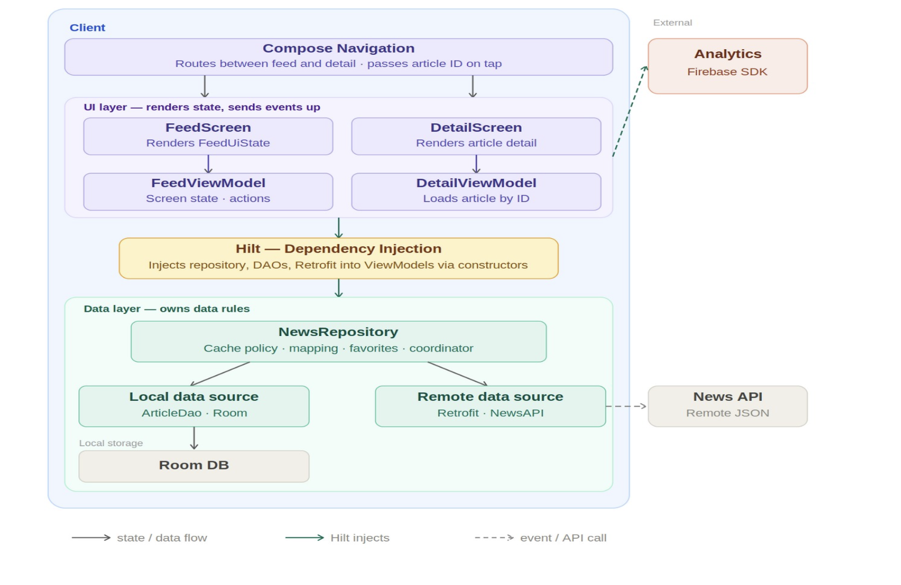
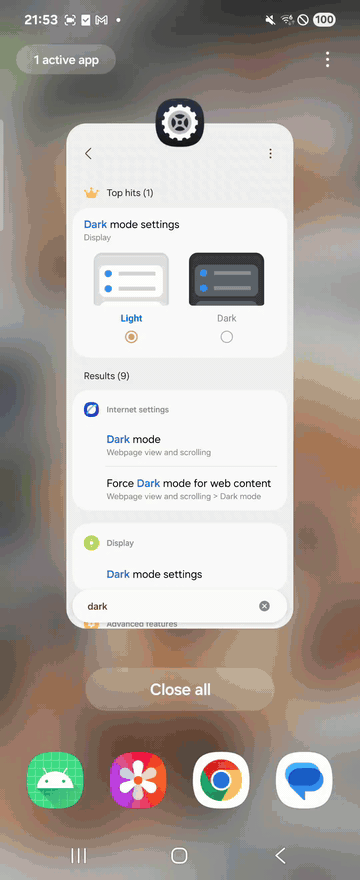

# NewsFlow System Design

NewsFlow is a personal Android system design project that demonstrates how I design, build, test, and document a production-style mobile feed.

The app lets a user browse top US headlines, search by keyword, open article detail, save favorites locally, keep reading cached content offline, and emit privacy-conscious analytics events for major user actions.

## Why This Project Exists

This repository is intentionally design-first. It shows how I turn product requirements into a working Android system with clear boundaries, cache ownership, failure handling, analytics privacy, and verification evidence.

The project is useful as a portfolio sample because it includes both the implementation and the design artifacts behind it:

- [System design write-up](docs/system_design.md)
- [Technical decisions](docs/technical_decisions.md)
- [High-level design diagram](docs/design/feed_system_design.pdf)
- [Deep-dive sequence diagram](docs/design/deep_dive_sequence.pdf)
- [Test report](docs/test_report.md)

## Product Scope

- Feed screen with top headlines
- Search with debounce
- Article detail screen
- Link from detail screen to the full article
- Favorite and unfavorite support
- Offline cache support
- Pull refresh
- Load-more pagination
- Light and dark theme support
- Firebase Analytics integration behind an abstraction
- Unit tests with a Kover coverage gate

## System Design Summary



The diagram summarizes the client architecture and its external dependencies. Compose Navigation routes between `FeedScreen` and `DetailScreen`, passing only the article ID when the user opens a detail view.

The UI layer renders state from the ViewModels and sends user actions upward. Hilt provides constructor injection for ViewModels and data collaborators. `NewsRepository` owns cache policy, mapping, pagination, favorite persistence, and coordination between Room and NewsAPI. Firebase Analytics and NewsAPI stay outside the client boundary.

Main package responsibilities:

- `ui.feed`: feed screen state and user actions
- `ui.detail`: article detail screen state and actions
- `domain`: app models, repository contract, and failure mapping
- `data.remote`: NewsAPI Retrofit service and response handling
- `data.local`: Room database, DAO, and entities
- `data.repository`: offline-aware repository implementation
- `analytics`: tracker abstraction and Firebase implementation
- `di`: Hilt modules

## Key Design Choices

- Repository owns the offline policy so ViewModels stay focused on screen state.
- Articles are normalized in Room so the same article can appear in multiple feed queries without duplicating content.
- Favorite state is stored separately from feed cache membership so refreshes do not erase saved articles.
- Analytics are routed through an `AnalyticsTracker` interface so Firebase is replaceable and test doubles stay simple.
- Search analytics send `query_length`, not the raw query.
- Article identifiers are hashed before analytics emission.
- Network and API failures are mapped into domain-level messages before they reach the UI.

Room stores feed data in four tables:

- `articles`: normalized article content
- `feed_cache`: cache metadata per feed key
- `feed_articles`: ordered page membership for each feed
- `favorites`: saved articles, separated from cache state

## Technical Stack

- Kotlin
- Jetpack Compose and Material 3
- MVVM
- Hilt dependency injection
- Retrofit and Gson
- Room
- Kotlin Coroutines and Flow
- Firebase Analytics
- Coil image loading
- JUnit, Robolectric, kotlinx-coroutines-test
- Kover test coverage

## Evidence

Main flow evidence:



- [Open full happy path video](docs/happy-cases.mp4)
- [Offline cached flow video](docs/cached-offline.mp4)
- [Firebase tracking DebugView video](docs/tracking-event.mov)

Edge case and coverage evidence:

- [Error edge case report](docs/error_edge_cases/error_edge_cases.pdf)
- [Coverage screenshot](docs/test-report.png)
- [Recorded test report](docs/test_report.md)

Latest recorded local run:

- Unit tests: 60 passed
- Line coverage: 87.3%
- Kover verification: passed

## API

Base URL:

```text
https://newsapi.org/
```

Implemented endpoint:

```http
GET /v2/top-headlines
```

Used query parameters:

- `country=us`
- `q=<search query>` when search is active
- `page=<page number>`
- `pageSize=20`
- `apiKey=<local key>`

Example:

```text
https://newsapi.org/v2/top-headlines?country=us&q=android&page=1&pageSize=20&apiKey=<API_KEY>
```

## Analytics

Tracked events:

- `article_viewed`
- `article_link_opened`
- `article_favorited`
- `article_unfavorited`
- `search_performed`
- `feed_refreshed`
- `load_more_triggered`

Privacy choices:

- Search tracking sends `query_length`, not the raw query.
- Article IDs are hashed before they are sent.
- Link tracking sends host and URL length, not the full URL.

## How To Run

1. Open the project in Android Studio.

2. Add a NewsAPI key to `local.properties`:

```properties
NEWS_API_KEY=your_newsapi_key_here
```

3. Optional: add Firebase config if you want Firebase DebugView locally:

```text
app/google-services.json
```

Use this package name for any Firebase Android app:

```text
com.huongstienstra.newsfeed
```

If `app/google-services.json` is not present, the app builds with a no-op analytics tracker.

4. Build and install:

```bash
./gradlew :app:assembleDebug
```

Or run directly from Android Studio.

## Firebase DebugView

With a device or emulator connected:

```bash
adb shell setprop debug.firebase.analytics.app com.huongstienstra.newsfeed
adb shell setprop log.tag.FA VERBOSE
adb shell setprop log.tag.FA-SVC VERBOSE
```

Then launch the app and open Firebase Analytics DebugView.

To disable DebugView later:

```bash
adb shell setprop debug.firebase.analytics.app .none.
```

## Tests

Run unit tests:

```bash
./gradlew :app:testDebugUnitTest
```

Run coverage:

```bash
./gradlew :app:koverHtmlReportDebug :app:koverVerifyDebug
```

Full local verification:

```bash
./gradlew :app:clean :app:testDebugUnitTest :app:koverHtmlReportDebug :app:koverXmlReportDebug :app:koverVerifyDebug :app:assembleDebug
```

## Notes

- API keys stay in `local.properties` and are not committed.
- Firebase config stays in `app/google-services.json` and is not committed.
- Generated build outputs and APK files are intentionally excluded from source control.
