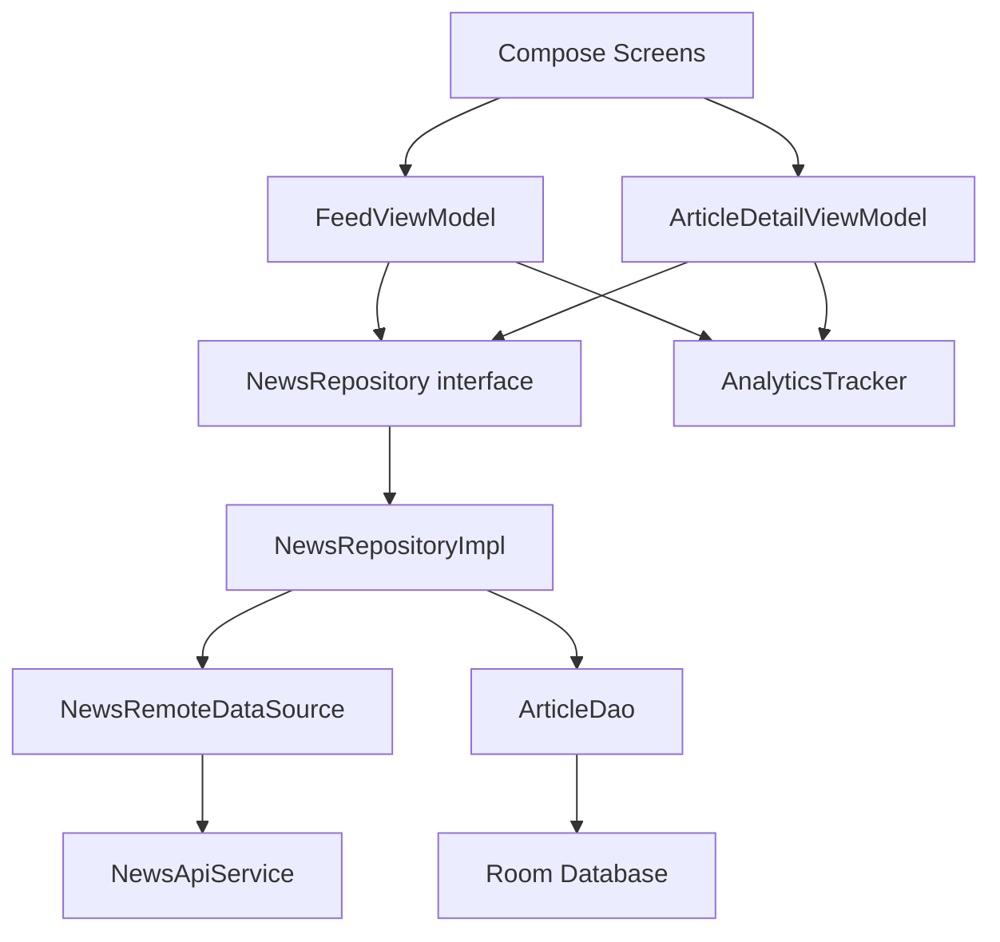

# NewsFlow System Design

This document explains the design thinking behind NewsFlow: a mobile news feed that supports search, pagination, favorites, offline cached reads, and privacy-conscious analytics.

## Goals

- Show a complete Android system from requirements to implementation.
- Keep UI state, data ownership, persistence, networking, and analytics in separate layers.
- Support a useful offline path instead of treating network failure as a dead end.
- Make testing practical by depending on interfaces at screen boundaries.
- Keep private user input out of analytics payloads.

## Non-Goals

- Building a full social news product.
- Creating an account system.
- Syncing favorites across devices.
- Owning or ranking news content beyond the upstream API response.

## Requirements

Functional requirements:

- Load top US headlines.
- Search headlines by keyword.
- Paginate through results.
- Open an article detail view.
- Open the original article link.
- Favorite and unfavorite articles.
- Show cached articles when the network is unavailable.
- Track important user actions.

Quality requirements:

- Clear offline behavior.
- Predictable error states.
- Local persistence that survives app restarts.
- Testable screen and repository behavior.
- No committed API keys or Firebase config.

## High-Level Architecture



The UI layer only knows about screen state and user actions. The repository owns the decision of when to call the network, when to update the cache, and when to serve cached data.

## Data Model

Room uses four tables:

- `articles`: canonical article records.
- `feed_cache`: metadata for each feed query, including cache identity.
- `feed_articles`: ordered relationship between a feed query and articles.
- `favorites`: saved article IDs.

This split avoids a common feed bug: replacing cached feed results should not delete a user's saved favorite state.

## Feed Identity

Feed results are keyed by a `FeedKey`. A default top-headlines feed and a searched feed are different cache entries because their result sets and pagination positions are independent.

That lets the repository answer questions like:

- Is this request for the default feed or a search feed?
- Which cached article order belongs to this feed?
- Is this load a refresh or a next-page request?

## Caching Strategy

Refresh flow:

1. Request page 1 from the remote data source.
2. Replace cached membership for the feed key.
3. Upsert normalized articles.
4. Keep favorite rows untouched.
5. Return fresh articles to the UI.

Load-more flow:

1. Request the next page for the current feed key.
2. Upsert normalized articles.
3. Append page membership for the feed key.
4. Return the merged list.

Offline fallback:

1. Try the remote request.
2. If the request fails, map the exception into a domain failure.
3. Read cached articles for the active feed key.
4. Show cached content with a user-readable warning when cache exists.
5. Show an empty/error state when cache does not exist.

## Failure Handling

Remote failures are converted into domain failures before they reach the UI:

- Missing API key
- Invalid API key
- Rate limited
- Network unavailable
- API error
- Unknown failure

The UI receives user-facing messages from the domain layer, not Retrofit exceptions.

## Analytics Design

Analytics are behind this interface:

```kotlin
interface AnalyticsTracker {
    fun track(event: AnalyticsEvent)
}
```

The ViewModels depend on the interface. Firebase is one implementation. Unit tests use a fake tracker.

Privacy choices:

- Track search query length, not search query text.
- Hash article identifiers before sending them.
- Track article link host and URL length, not full URLs.

## Testing Strategy

Unit coverage focuses on the behavior that carries product risk:

- Feed pagination and refresh state.
- Search debounce and submission behavior.
- Favorite toggling.
- Detail screen state.
- Repository cache behavior.
- Failure mapping.
- Analytics event shape and privacy rules.

The project uses Kover verification with an 80% minimum line coverage gate.

## Scaling Discussion

If this were extended into a larger product, the next design moves would be:

- Add remote config for page size, cache TTL, and feature flags.
- Add WorkManager for background cache refresh.
- Add a sync layer if favorites become account-backed.
- Add observability around cache hit rate and API failure rate.
- Add paging library support if feed complexity grows.
